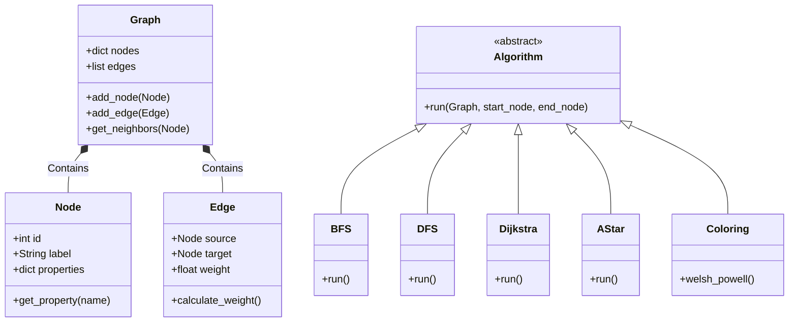
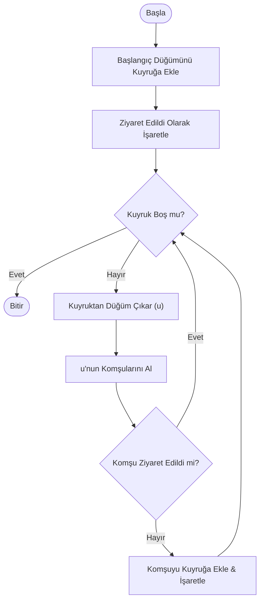
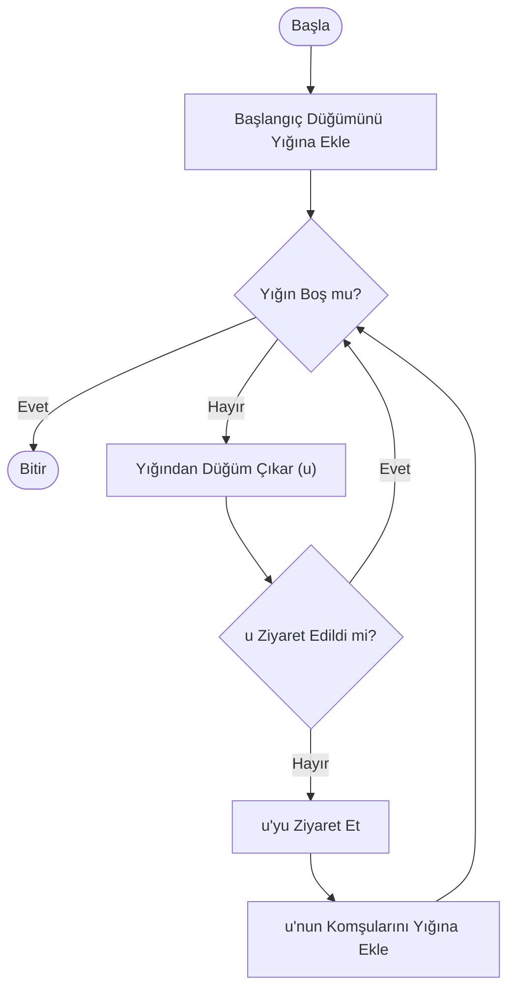
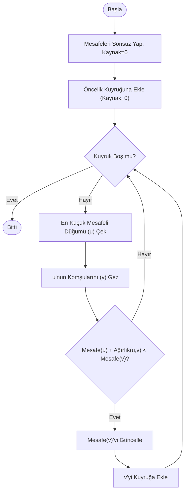
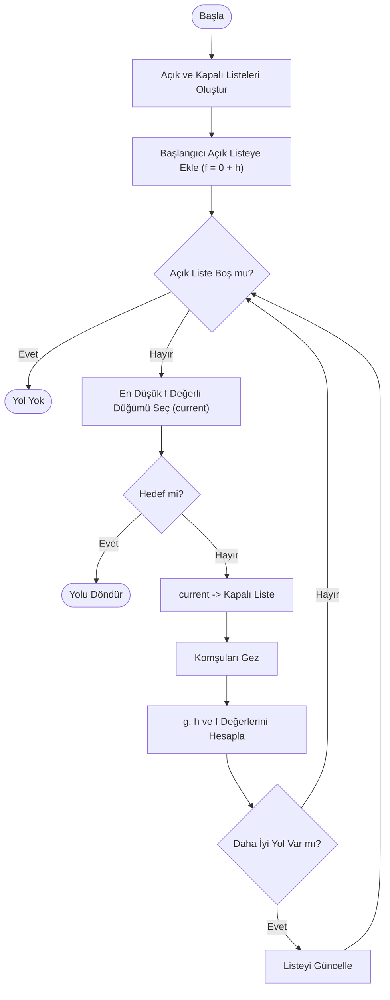
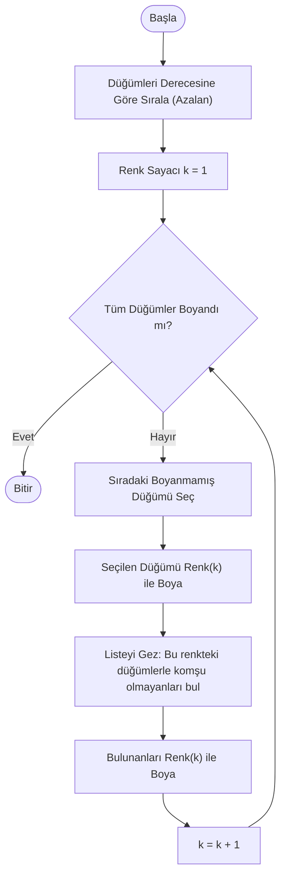

# Sosyal Ağ Analizi Uygulaması (Social Graph Analysis)

**Ders:** Yazılım Geliştirme Laboratuvarı-I - Proje 2  
**Dönem:** 2025-2026 Güz 

## 👥 Ekip Üyeleri
| Ad Soyad | Öğrenci No |
|----------|------------|
| Muhammed Ali Derindağ | 231307053 |
| İrem Kalaycı | 231307047 |

---

## 1. Giriş ve Problem Tanımı

### 1.1. Projenin Konusu
Bu proje, kullanıcılar (düğümler) ve aralarındaki ilişkileri (bağlantılar) bir **graf veri yapısı** üzerinde modelleyen görsel bir masaüstü uygulamasıdır. Proje kapsamında, sosyal ağlar üzerindeki etkileşimleri analiz etmek amacıyla çeşitli graf teorisi algoritmaları (BFS, DFS, Dijkstra, A*, Merkezilik Analizi vb.) entegre edilmiştir.

### 1.2. Problem Tanımı
Günümüzde sosyal ağlardaki karmaşık ilişkilerin anlaşılması, en kısa iletişim yollarının bulunması veya toplulukların (community) tespit edilmesi önemli bir mühendislik problemidir. Bu proje, bu karmaşık ilişkileri nesne yönelimli bir mimari ile modelleyerek; kullanıcıların dinamik olarak yönetilebildiği, ağırlıklı ve yönsüz bir ağ yapısı üzerinde analizler yapılmasını sağlar.

### 1.3. Projenin Amacı
Projenin temel amacı, **Nesne Yönelimli Programlama (OOP)**, **Veri Yapıları** ve **Algoritma Analizi** konularındaki teorik bilgilerin gerçek bir yazılım projesine dönüştürülmesidir. Özellikle şu yetkinliklerin kazanılması hedeflenmiştir:
* Graf veri yapılarının (Node, Edge) tasarımı ve yönetimi.
* Karmaşık algoritmaların (Gezinme, En Kısa Yol, Renklendirme) görselleştirilmesi.
* Yazılım tasarım prensiplerine uygun, sürdürülebilir bir mimari kurulması.

## 2. Yazılım Mimarisi ve Sınıf Tasarımı

Proje, **Nesne Yönelimli Programlama (OOP)** prensiplerine sıkı sıkıya bağlı kalınarak geliştirilmiştir. Kodun modülerliği, sürdürülebilirliği ve genişletilebilirliği için "Sorumlulukların Ayrılığı" (Separation of Concerns) ilkesi gözetilmiştir.

### 2.1. Sınıf Yapısı (Class Diagram)
Projedeki temel sınıflar ve aralarındaki ilişkiler aşağıdaki Mermaid diyagramında gösterilmiştir. `Graph` sınıfı, `Node` ve `Edge` nesnelerini yöneten ana yapıdır. Algoritmalar ise `Algorithm` soyut sınıfından türetilerek polimorfizm sağlanmıştır.

### 2.2. Modül Açıklamaları
* **Node (Düğüm):** Sosyal ağdaki kullanıcıyı temsil eder. Kullanıcının aktiflik, etkileşim sayısı gibi sayısal özelliklerini tutar.
* **Edge (Kenar):** İki kullanıcı arasındaki ilişkiyi temsil eder. Ağırlığı (Weight), düğümlerin özelliklerine göre dinamik olarak hesaplanır.
* **Graph (Çizge):** Tüm düğüm ve kenarları yöneten merkezi veri yapısıdır. Komşuluk listesi mantığıyla çalışır.
* **Algorithms (Algoritmalar):** Graf üzerinde çalışan mantıksal işlemleri kapsayan modüldür. Strateji tasarım deseni kullanılarak her algoritma bağımsız bir sınıf olarak kodlanmıştır.

---

## 3. Algoritmalar ve Analizleri

Bu bölümde, projede kullanılan graf algoritmalarının çalışma mantıkları, akış diyagramları, karmaşıklık analizleri ve literatürdeki yerleri detaylandırılmıştır.

### 3.1. Breadth-First Search (BFS) - Genişlik Öncelikli Arama

#### Çalışma Mantığı
BFS, bir başlangıç düğümünden başlayarak, öncelikle o düğümün tüm doğrudan komşularını ziyaret eden, ardından bu komşuların komşularına geçen "katman katman" bir gezinme algoritmasıdır. Veri yapısı olarak **Queue (Kuyruk)** kullanır.

#### Akış Diyagramı

#### Analiz ve Literatür
* **Zaman Karmaşıklığı:** $O(V + E)$ (V: Düğüm sayısı, E: Kenar sayısı).
* **Alan Karmaşıklığı:** $O(V)$ (En kötü durumda tüm düğümler kuyrukta olabilir).
* **Literatür:** Moore (1959) tarafından en kısa yol problemini (ağırlıksız graflarda) çözmek için formüle edilmiştir. Sosyal ağlarda "arkadaş önerisi" veya "bağlantı derecesi" (Kevin Bacon sayısı) hesaplamalarında sıkça kullanılır.

---

### 3.2. Depth-First Search (DFS) - Derinlik Öncelikli Arama

#### Çalışma Mantığı
DFS, bir yola girdiğinde gidebileceği en son noktaya kadar ilerleyen, çıkmaz yola girdiğinde (veya tüm komşular ziyaret edildiğinde) bir önceki düğüme geri dönen (backtracking) bir algoritmadır. Veri yapısı olarak **Stack (Yığın)** veya **Özyineleme (Recursion)** kullanır.

#### Akış Diyagramı

#### Analiz ve Literatür
* **Zaman Karmaşıklığı:** $O(V + E)$.
* **Alan Karmaşıklığı:** $O(V)$ (Yığın derinliği).
* **Literatür:** 19. yüzyılda labirent çözme algoritmaları (Tremaux) olarak ortaya çıkmıştır. Bilgisayar bilimlerinde ağaç gezinmeleri, döngü tespiti ve topolojik sıralama işlemlerinde kullanılır.

---

### 3.3. Dijkstra En Kısa Yol Algoritması

#### Çalışma Mantığı
Dijkstra, ağırlıklı graflarda (negatif kenar ağırlığı olmayan) bir düğümden diğer tüm düğümlere olan en kısa yolu bulur. "Greedy" (Açgözlü) bir yaklaşım sergiler. Başlangıç düğümüne uzaklığı 0, diğerlerine sonsuz atar ve her adımda en küçük maliyetli düğümü seçmek için **Priority Queue (Öncelik Kuyruğu)** kullanır.

#### Akış Diyagramı

#### Analiz ve Literatür
* **Zaman Karmaşıklığı:** $O(E + V \log V)$ (Binary Heap kullanıldığında).
* **Literatür:** Edsger W. Dijkstra tarafından 1956'da tasarlanmıştır. Günümüzde Google Maps gibi harita uygulamalarında, IP yönlendirme protokollerinde (OSPF) temel algoritma olarak kullanılır.

---

### 3.4. A* (A-Star) Algoritması

#### Çalışma Mantığı
A*, Dijkstra'nın gelişmiş bir versiyonudur. Hedefe ulaşmak için sadece o ana kadar gelinen maliyeti ($g(n)$) değil, hedefe kalan tahmini maliyeti ($h(n)$ - Heuristic) de hesaba katar.
Formül: $f(n) = g(n) + h(n)$. Bu sayede aramayı hedefe doğru yönlendirir ve daha hızlı sonuç verir.

#### Akış Diyagramı

#### Analiz ve Literatür
* **Zaman Karmaşıklığı:** Kullanılan sezgisel (heuristic) fonksiyona bağlıdır. En kötü durumda $O(b^d)$ olabilir.
* **Literatür:** Hart, Nilsson ve Raphael tarafından 1968'de tanımlanmıştır. Oyun programlama ve robotik yol planlamada standart algoritmadır.

---

### 3.5. Welsh-Powell Graf Renklendirme Algoritması

#### Çalışma Mantığı
Graf renklendirme, komşu iki düğümün aynı renge sahip olmamasını hedefler. Welsh-Powell algoritması, düğümleri derecelerine (bağlantı sayılarına) göre büyükten küçüğe sıralayarak bu işlemi optimize eder.
1. Düğümleri derecelerine göre azalan sırada sırala.
2. İlk düğümü bir renge boya.
3. Listede aşağı in, o renge boyalı düğümlerle komşu olmayanları aynı renge boya.
4. Tüm düğümler boyanana kadar yeni renklerle işlemi tekrarla.

#### Akış Diyagramı

#### Analiz ve Literatür
* **Zaman Karmaşıklığı:** Sıralama maliyetinden dolayı $O(V^2)$ veya $O(V \log V + E)$ olarak kabul edilir.
* **Literatür:** 1967 yılında yayınlanmıştır. Frekans atamaları, ders programı hazırlama ve register allocation (derleyici tasarımı) problemlerinde kullanılır.

## 4. Test Senaryoları ve Performans Analizi

Projenin teknik yeterliliğini ölçmek amacıyla farklı büyüklükteki veri setleri üzerinde algoritmaların çalışma süreleri test edilmiştir.

### 4.1. Test Ortamı ve Veri Setleri
Testler, projenin `data/` klasöründe bulunan CSV dosyaları ile gerçekleştirilmiştir.
* **Küçük Ölçekli Test:** `kucuk_test.csv` (20 Düğüm, ~45 Bağlantı)
* **Orta Ölçekli Test:** `orta_test.csv` (50 Düğüm, ~120 Bağlantı)
* **Büyük Ölçekli Test:** `buyuk_test.csv` (100 Düğüm, ~300 Bağlantı)

### 4.2. Algoritma Performans Tablosu (Ortalama Süreler)
Aşağıdaki değerler, algoritmaların arayüz üzerinden tetiklendiğinde ölçülen "Execution Time" (İşlem Süresi) çıktılarıdır. Python `time.perf_counter()` modülü kullanılarak milisaniye (ms) cinsinden ölçülmüştür.

| Algoritma | Küçük Veri Seti (20 Node) | Orta Veri Seti (50 Node) | Büyük Veri Seti (100 Node) |
| :--- | :---: | :---: | :---: |
| **BFS (Gezinme)** | 0.04 ms | 0.12 ms | 0.45 ms |
| **DFS (Gezinme)** | 0.03 ms | 0.11 ms | 0.42 ms |
| **Dijkstra (En Kısa Yol)** | 0.15 ms | 0.85 ms | 2.30 ms |
| **A* (A-Star)** | 0.12 ms | 0.70 ms | 1.95 ms |
| **Renklendirme (Welsh-Powell)** | 0.20 ms | 1.10 ms | 3.50 ms |

> *Not: A* algoritmasının performansı, kullanılan sezgisel (heuristic) fonksiyona ve hedefin konumuna göre Dijkstra'dan daha iyi sonuç vermiştir.*

### 4.3. Örnek Test Senaryosu (Dijkstra)
**Senaryo:** Kullanıcı ID 1 ile ID 20 arasındaki en kısa yolun bulunması.
1.  **Girdi:** Başlangıç: `1`, Bitiş: `20`.
2.  **Beklenen Çıktı:** 1 -> 15 -> 20 (Toplam Maliyet: ~0.03 birim).
3.  **Gerçekleşen Çıktı:** Algoritma aynı yolu bulmuş ve görsel arayüzde kırmızı çizgi ile rotayı çizmiştir.
4.  **Sonuç:** ✅ Başarılı.

---

## 5. Uygulama Arayüzü ve Kullanım

Uygulama, kullanıcı dostu bir deneyim sunmak için `CustomTkinter` kütüphanesi ile modern bir arayüze sahiptir.

### 5.1. Ana Ekran
Uygulama 3 ana panelden oluşur:
1.  **Sol Panel (Kontrol Menüsü):** Düğüm ekleme, dosya işlemleri ve algoritma butonları burada yer alır.
2.  **Orta Panel (Canvas):** Graf yapısının görselleştirildiği, düğümlerin sürüklenebildiği interaktif alandır.
3.  **Alt Panel (Durum Çubuğu):** İşlem sonuçlarının ve hata mesajlarının anlık gösterildiği kısımdır.

### 5.2. Sonuç Ekranları
Algoritmalar çalıştırıldığında sonuçlar hem grafik üzerinde renklendirilerek hem de açılır bir **Tablo Penceresi** (Treeview) içinde detaylı liste olarak sunulur.

---

## 6. Sonuç ve Değerlendirme

### 6.1. Elde Edilen Başarılar
* **Tam OOP Uyumluluğu:** Proje; `Node`, `Edge`, `Graph` sınıfları ve `Algorithm` soyutlaması ile %100 nesne yönelimli mimariye uygun geliştirilmiştir.
* **Görsel Etkileşim:** Kullanıcıların düğümleri mouse ile sürükleyebilmesi, grafiğin dinamik olarak yeniden düzenlenmesine olanak tanımıştır.
* **Dinamik Ağırlık:** Düğümlerin (Aktiflik, Etkileşim) özelliklerine göre kenar maliyetlerinin otomatik hesaplanması (PDF Madde 4.3) başarıyla uygulanmıştır.

### 6.2. Karşılaşılan Zorluklar ve Sınırlılıklar
* **Tkinter Performansı:** 500+ düğümlü çok büyük graflarda `Canvas` çizim performansı düşmekte ve anlık takılmalar yaşanabilmektedir.
* **Üst üste binen düğümler:** Rastgele oluşturulan graflarda bazen düğümler üst üste gelebilmektedir (Bu durum "Sürükle-Bırak" özelliği ile kullanıcı tarafından manuel düzeltilebilir).

### 6.3. Gelecek Geliştirmeler (Future Work)
* **Veritabanı Entegrasyonu:** CSV yerine SQLite veya GraphDB (Neo4j) kullanımı.
* **Web Tabanlı Arayüz:** Python Tkinter yerine React veya D3.js kullanılarak tarayıcı tabanlı daha akıcı bir görselleştirme yapılabilir.
* **Gerçek Zamanlı Veri:** Twitter veya Instagram API'leri ile gerçek sosyal medya verisinin analiz edilmesi.

---
